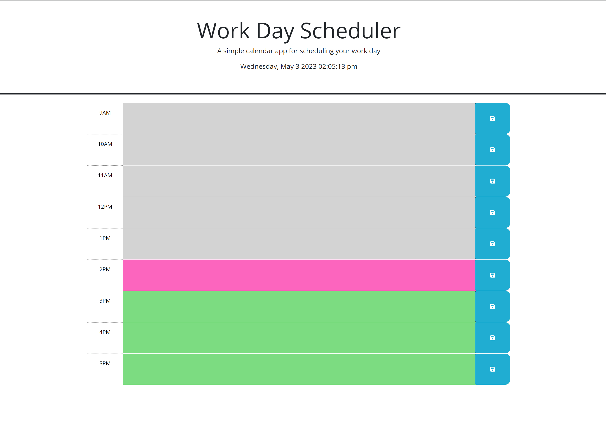
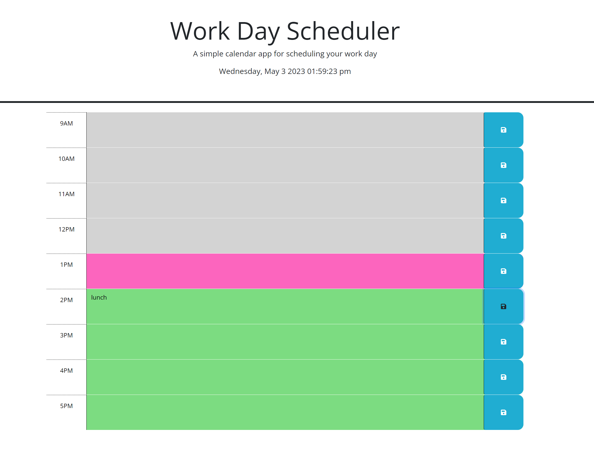

# Daily Planner

## Description

- User is using a daily planner to create a schedule
- After User opens the planner then the current day is displayed at the top of the calendar
- When User scrolls down then he/she is presented with time blocks for standard business hours
- When User views the time blocks for that day then each time block is color-coded to indicate whether it is in the past, present, or future
- After clicking into a time block User can enter an event
- After clicking the save button for that time block then  the text for that event is saved in local storage
- When User refreshes the page then the saved events persist

## Usage
 
 After clicking the link below you will be able to see deployed application.

  https://elenafwork.github.io/05-Daily-Planner/

  The start page looks like this:
  

  

  After saving the event the page looks like this:

  

## Credits

- StuckOwerflow:
https://stackoverflow.com/questions/7667958/clearing-localstorage-in-javascript
- jQuery https://api.jquery.com/category/manipulation/class-attribute/
- Dayjs https://day.js.org/docs/en/get-set/hour

## License

Please, refer to the repo license

